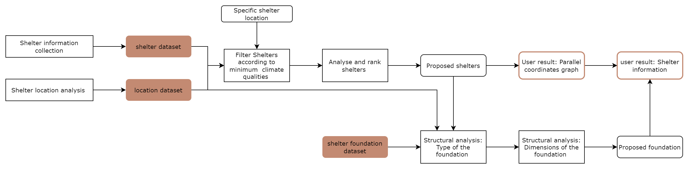

# Find Your Shelter 
## An information-driven framework to increase efficiency in site-specific shelter decision making process.

This repository contains the code that is written for the course 'CORE AR3B012' of TU Delft MSC Building Technology. For further detailed information, check the full documentation: [_Find Your Shelter: An information-driven framework to increase efficiency in site-specific shelter decision making process_](/doc/placeholder_final_report). 

A documentation (a "readme") that explains the digital workflow, including a guide on how to run the code (i.e. which Python scripts need to be run for which functionalities). Include the flowcharts, and/or pseudocode, and/or any other relevant diagrams to help illustrate the code's functionalities.

The digital workflow

how the code is structured: 

 


The code works from it's own functions-library: Shelter.py

The code is split in different files, organised by the different parts of the tool. The shelter.py document is the main functions library for this documentation. The other files are to be run in the following order: 
- shelter_locations
- fastest_path
- location_info
- shelter_decisionsupport

The last file, Shelter_decisionsupport.py, is the file that carries out the analysis and provides the visualisations. 

important supporting files are the files in found in the data folder: 
- data/population_tur_2020.csv
- soil data.xlsx / soil_data.csv
- soil_consistency.csv
- shelters.xlsx

Further information is retrieved from ditigal datasources when running the code. It is thus important that a (stable) internet connection is available. 


## How to Use
This project is written and tested in Python 3.9.

### Clone the repo and install dependencies
Clone the repository:
```sh
git clone https://github.com/maartjedamen/shelterproject
cd natural-surveillance
```

### Location selection
To start the analysis, open the shelter_locations.ipynb. The focus of the data in this file is the open street map library. 
Here, **you fill in the location that is to be analyzed**. In the current situation, a bounding box is used. Slight alterations also allow for analysis for regions from OSM, like the municipality that a user might be invested in. 

For the first selection of potential shelter locations, all green areas are selected. In the example, we continue with a smaller selection: sportsfields. 
The code then determines size and does a filter to remove areas that are too small for shelter clusters. It cleans the data and saves it to a geoJSON file. A future option would be to include a buffer of the waterways in the location selections, as is shown in the code. 

After this, all waterways are selected. This could be used to remove potential shelter areas within high-risk flood areas. 

The centroids of each shelter location are retrieved, and used for a voronoi calculation. These Voronoi areas are later used for a simplified analysis of population per shelter location. 

The fastest_path.ipynb is a file that showcases the option for generating the fastest path from one location to a shelter location. The aim for this tool was to function in two directions: 
- optimization of the shelter delivery time
    By using the fastest path from main delivery locations like airports or harbours, differences in time for shelter locations can be derived. This can influence the decision on materiality of the shelters, as with a longer delivery time, the use of (more) local materials would become more efficient. 
- an optimization loop of the shelter area allocation: 
    By dividing the population to different shelter locations based on their fastest path, an estimation can be done based on which camps will be (over)crowded, and a feedbackloop can be used to evaluate the shelter locations and add/remove some. 

*In the end, the fastest_path.ipynb has not been taken into use due to complexity within the given timeframe.*

###  Database 
The next file is the shelter_info.ipynb. 
In this file, the shelter locations are joined with their location specific data. No additional information is needed: it can be run after the shelter_locations is finished running.  
it appends population data, weather data and elevation data of each location to form an elaborate GeoDataFrame. This is then saved in the data-folder. 

### Shelter Decision Support
The final file is the Shelter_decisionsupport.py. With running this file, the location analysis is being executed, the decision support graph is being generated, and a structural analysis is being excecuted to suggest a good foundation type.
- Run the file (Ctrl+f5) 
- in the terminal, the question is asked: for which location would you like to find shelters? In the terminal, fill in the number that matches the shelter location. 
- after this, the decision support tool is shown. compare, and select the shelters.
- the question gets asked to retrieve the soiltype from the link. In the terminal, fill in the letter that is found on the website for the current location. 
- The question gets asked to fill in the shape type of the chosen shelter. Fill this in in the terminal

After this, the structural analysis is being excecuted and all information that is needed for the user is handed. 


 

 
